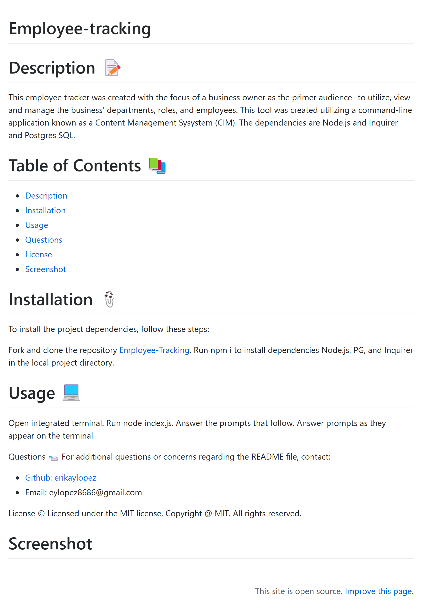
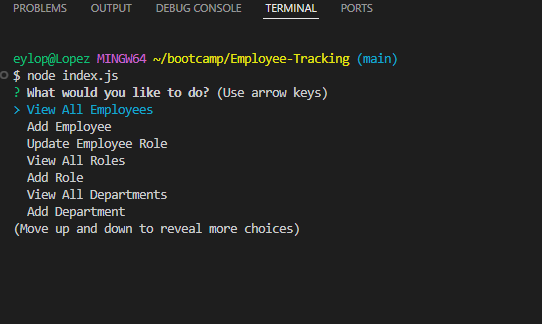

# Employee-tracking

# Description 📝
This employee tracker was created with the focus of a business owner as the primer audience- to utilize, view and manage the business' departments, roles, and employees. This tool was created utilizing a command-line application known as a Content Management Sysystem (CIM). The dependencies are Node.js and Inquirer and Postgres SQL.

# Table of Contents 📚
- [Description](#description-📝)
- [Installation](#installation-📎)
- [Usage](#usage💻)
- [Questions](#questions-📨)
- [License](#license©)
- [Screenshot](#screenshot)

# Installation 📎
To install the project dependencies, follow these steps:

Fork and clone the repository [Employee-Tracking](https://github.com/erikaylopez/Employee-tracking).
Run npm i to install dependencies Node.js, PG, and Inquirer in the local project directory.

# Usage 💻
Open integrated terminal.
Run node index.js.
Answer the prompts that follow.
Answer prompts as they appear on the terminal.

Questions 📨
For additional questions or concerns regarding the README file, contact:

- [Github: erikaylopez](https://github.com/erikaylopez)
- Email: eylopez8686@gmail.com

License ©
Licensed under the MIT license. Copyright @ MIT. All rights reserved.

# Screenshot

